# Employee Management System (SQL Project)

## Problem Statement

Organizations manage large amounts of employee data including personal information, departments, salaries, attendance records, and performance reviews. When this data is not properly organized, it becomes difficult to retrieve useful information for decision-making.

This project solves that problem by creating a **relational SQL database** that organizes employee information into structured tables. The system allows managers and analysts to easily retrieve, analyze, and interpret employee data using SQL queries.

---

# Project Objectives

The main objectives of this project are:

- Design a relational database to manage employee data.
- Organize employee information across multiple related tables.
- Demonstrate the use of **primary keys and foreign keys**.
- Use SQL queries to retrieve and analyze employee data.
- Perform analytical queries such as filtering, sorting, and ranking employees.
- Demonstrate pagination and data retrieval techniques.

---

# Dataset Description

The dataset represents information typically stored in an organization's **Human Resources system**.

It includes the following categories of employee data:

- Employee personal information
- Departments within the company
- Job roles and salary ranges
- Salary history of employees
- Attendance records
- Employee performance reviews

This data is stored across **six structured tables** to maintain proper relationships and avoid redundancy.

---

# Database Schema

The database used in this project is called:
ProjectAss

The schema contains **six main tables**.

---

## 1. Jobs

This table keeps information about the different **types of jobs** available in the company.

| Column | Meaning |
|------|-------------|
| JobID | A special number used to identify each job |
| JobTitle | The name of the job (for example: Manager, Accountant) |
| MinSalary | The lowest salary someone in that job can earn |
| MaxSalary | The highest salary someone in that job can earn |

---

## 2. Departments

This table stores information about the **different sections of the company**.

| Column | Meaning |
|------|-------------|
| DeptID | A unique number used to identify each department |
| DeptName | The name of the department (for example: Finance, HR) |
| Location | Where the department is located |

---

## 3. Employees

This table stores **basic information about each employee** who works in the company.

| Column | Meaning |
|------|-------------|
| EmployeeID | A unique number for each employee |
| FirstName | The employee’s first name |
| LastName | The employee’s last name |
| DateOfBirth | The employee’s date of birth |
| Gender | The employee’s gender |
| Email | The employee’s email address |
| PhoneNumber | The employee’s phone number |
| HireDate | The date the employee started working |
| JobID | The job the employee does |
| DepartmentID | The department the employee belongs to |
| ManagerID | The manager the employee reports to |
| Status | Whether the employee is currently working or not |

Status can be:

- **Active** – The employee is currently working.
- **Inactive** – The employee is no longer working.
- **On Leave** – The employee is temporarily away from work.

---

## 4. Salaries

This table stores information about **how much employees are paid**.

| Column | Meaning |
|------|-------------|
| SalaryID | A unique number for each salary record |
| EmployeeID | The employee who receives the salary |
| SalaryAmount | The amount of money the employee earns |
| FromDate | The date the salary started |
| ToDate | The date the salary ended (if it changed later) |

---

## 5. Attendance

This table keeps track of **whether employees came to work each day**.

| Column | Meaning |
|------|-------------|
| AttendanceID | A unique number for each attendance record |
| EmployeeID | The employee the record belongs to |
| AttendanceDate | The day the attendance was recorded |
| Status | Whether the employee was Present, Absent, or on Leave |
| CheckInTime | The time the employee arrived at work |
| CheckOutTime | The time the employee left work |

---

## 6. Performance

This table stores **how well employees are doing at their jobs** based on reviews.

| Column | Meaning |
|------|-------------|
| PerformanceID | A unique number for each performance review |
| EmployeeID | The employee being reviewed |
| ReviewDate | The date the review was done |
| Rating | A score between 1 and 5 showing performance |
| Comments | Notes from the manager about the employee’s performance |

A **rating of 5 means excellent performance**, while **1 means very poor performance**.

## SQL Analysis

Several SQL queries were written to analyze the data and retrieve useful information. To mention a few:

---

## 1. Employee Full Name and Email
This query combines the employee’s first name and last name to create a full name and then shows their email address.

Screenshot

[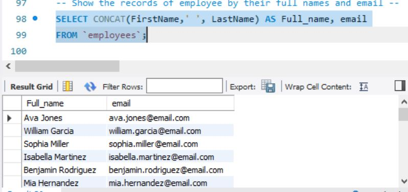](Screenshots/recordofemployeesfullnameandemail.JPG)

Lesson Learned
- We can combine two columns (first name and last name) to create a full name.
- The query shows the email address for every employee.
- This kind of query can help a company quickly create a contact list of employees.

Example employees shown include:
Ava Jones
William Garcia
Sophia Miller
Isabella Martinez

## 2. Active Employees
There are 61 active employees in the company.

Lesson Learned
- The company currently has 61 employees actively working.
- This query helps managers quickly know the current workforce size.
- It can also help HR track how many employees are still employed.

Screenshot

[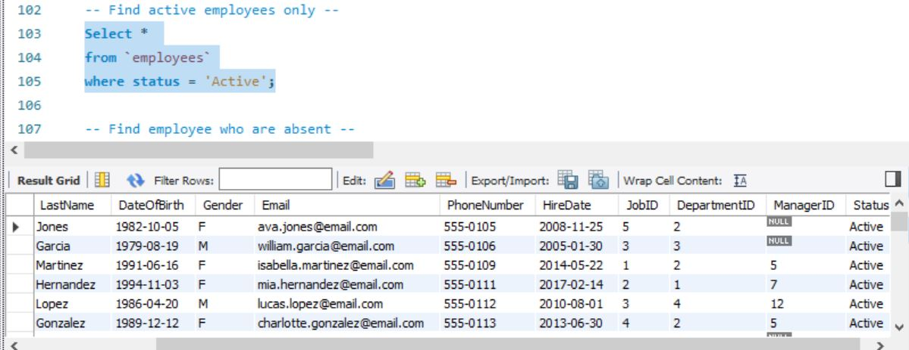](Screenshots/active_employees_only.JPG)

## 3. Employees Who Are Absent
There are 58 employees marked as absent in the attendance records.

Lesson Learned
- A large number of employees were not present at work on the recorded day(s).
- Attendance data can help HR monitor absenteeism.
- Managers can use this information to identify attendance problems early.

Screenshot

[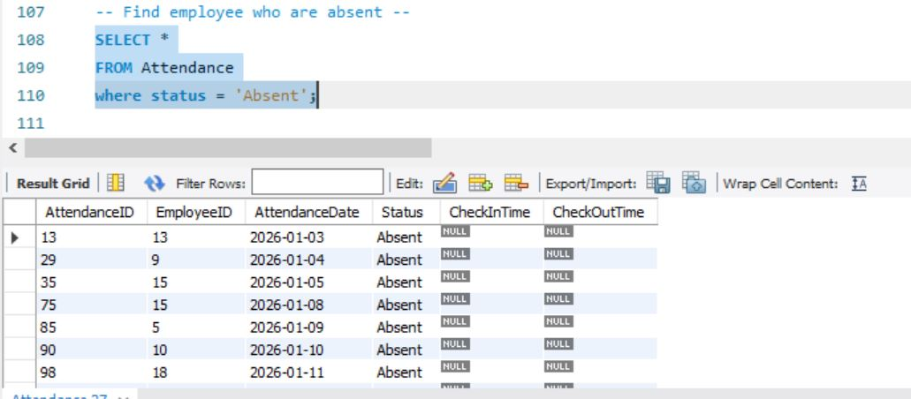](Screenshots/employees_who_are_absent.JPG)

## 4. Active Employees in the Finance Department
There are 57 active employees in the Finance department.

Lesson Learned
- The Finance department has a large number of active staff.
- This query helps management understand staff distribution across departments.
- It can help HR decide if a department needs more or fewer employees.

Screenshot
[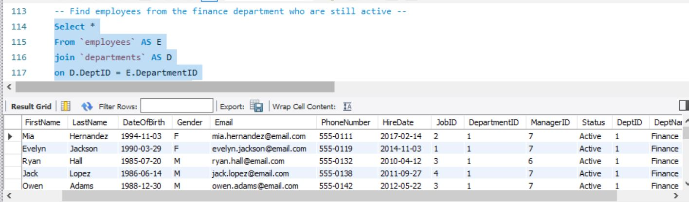](Screenshots/employees_from_the_finance_department_who_are_still_active.JPG)

## 5. Employees Paid Above 100,000
There are 56 employee records earning above 100,000.

Lesson Learned
- Many employees in the organization earn more than 100,000 in salary.
- This query helps identify higher-paid employees.
- It can help management analyze salary structures and compensation levels.

Screenshot
[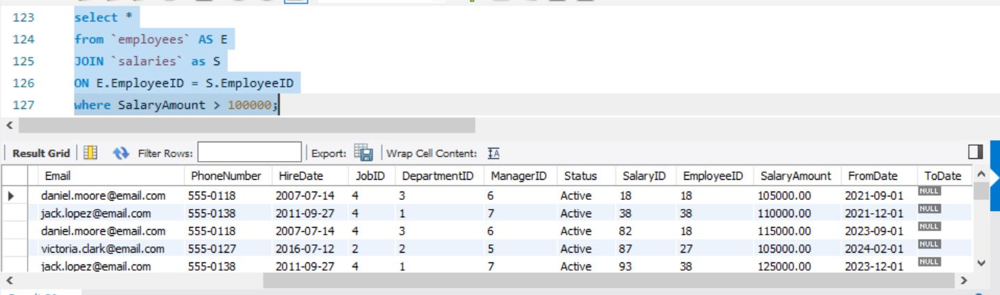](Screenshots/employee_records_who_are_paid_above_one_hundred_thousand.JPG)

Screenshots/employee_records_who_are_paid_above_one_hundred_thousand.JPG

## 6. Employees from HR and Finance Departments
This query displays information about employees working in the HR and Finance departments.

Lesson Learned
- The query helps filter employees based on specific departments.
- It allows managers to quickly view staff details within selected departments.
- This can help when preparing department reports or internal audits.

Screenshot
[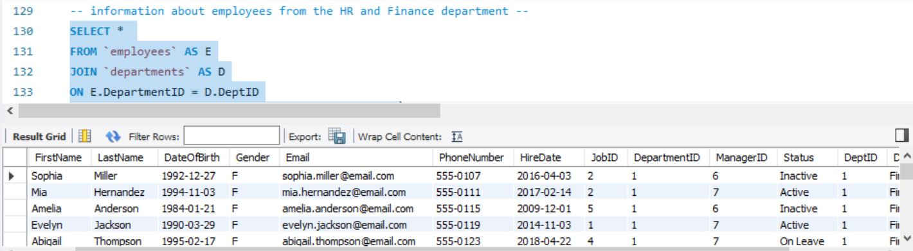](Screenshots/information_about_employees_from_the_HR_and_Finance_department.JPG)

## 7. Employees Who Are Not Active
There are 54 employees who are not active.

Lesson Learned
- Some employees in the system are no longer actively working.
- This could mean they have resigned, been terminated, or are on leave.
- HR can use this information to track employee turnover.

Screenshot
[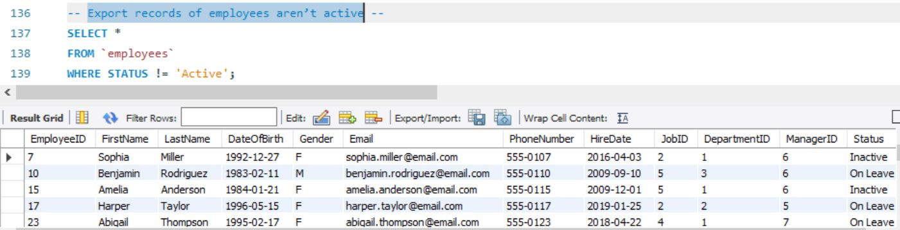](Screenshots/Export_records_of_employees_aren’t_active.JPG)

## 8. Attendance Records for January 2026
There are 53 employees who have attendance records for January 2026.

Lesson Learned
- The query shows employees who were present during January 2026.
- This helps track monthly attendance patterns.
- Management can use this information to analyze employee participation and consistency.

Screenshot

## 9. Active Employees from the Finance Department
There are 52 active employees in the Finance department.

Lesson Learned
- The Finance department still has many active employees contributing to operations.
- This helps managers see how many employees are currently active in a specific department.
- The information can help in department workforce planning.

Screenshot
[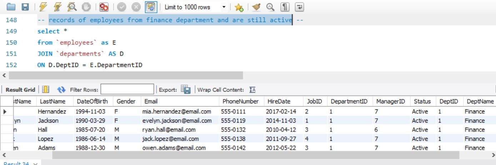](Screenshots/records_of_employees_from_finance_department_and_are_still_active.JPG)

## 10. Order Employees by last name alphabetically
Ordering Employees by last name alphabetical, '42', 'Owen', 'Adams', ranks top

Lesson Learned
- The query sorts employees from A to Z by their last name.
- Sorting makes it easier to find employees quickly in large lists.

Screenshot
[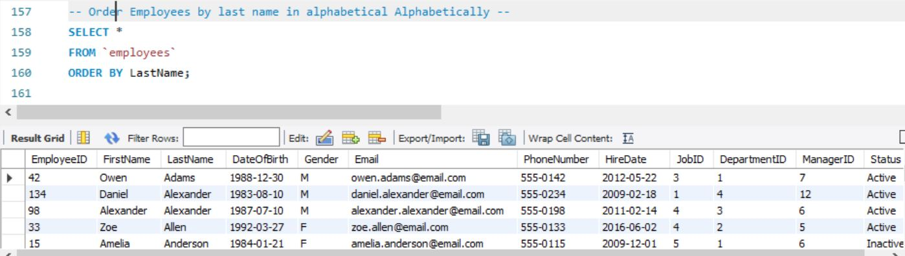](Screenshots/Order_Employees_by_last_name_in_alphabetically.JPG)

## 11. Records of employees with the Highest Salaries First
There is a records of 50 employees that receives the Highest Salaries

Lesson Learned
- Employees are arranged from the highest-paid employee to the lowest-paid employee.
- This helps managers see how salaries are distributed across employees.

Screenshot
[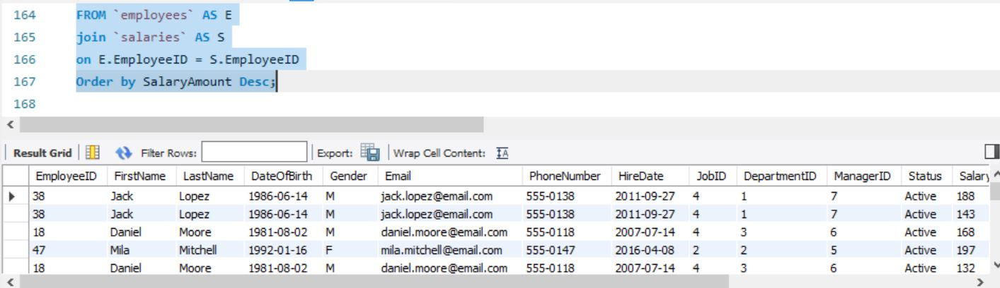](Screenshots/Records_of_employees_with_the_Highest_Salaries_First.JPG)

## 12. Unique Departments in the organization
There are 49 Unique Departments in the organization

Lesson Learned
- The query removes duplicate department records.
- It shows a clean list of all departments in the company.

Screenshot
[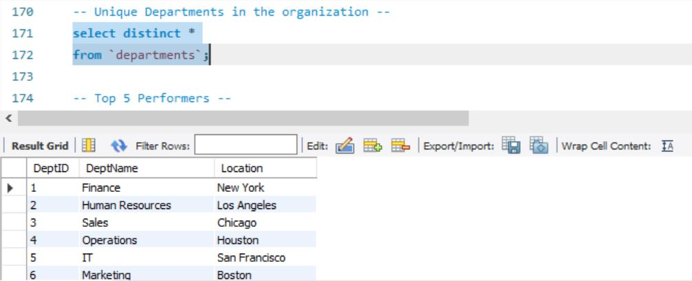](Screenshots/Unique_Departments.JPG)

## 13. Top 5 Performing Employees
This query identifies the highest-performing employees based on their rating.

Lesson Learned
- Employees are arranged from the highest rating to the lowest rating.
- If two employees have the same rating, the one with the most recent review appears first.
- The top employees have a rating of 5, which means excellent performance.
- This helps managers easily identify the best-performing employees in the company.

The top 5 employees are mentioned below:
Sophia	Miller
Harper	Taylor
Mia	Hernandez
Sophia	Miller
Harper	Taylor

Screenshot
[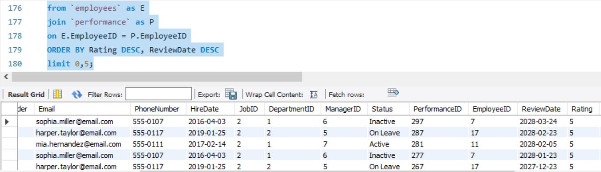](Screenshots/Top_5_Performers.JPG)

## 14. Next 5 Employees
This query retrieves the next group of employees after the first five records.

Lesson Learned
- This query demonstrates something called pagination.
- Pagination means showing results in smaller groups instead of all at once.
- The first query shows the top 5 employees, and this query shows employees 6 to 10.
- Pagination is useful when working with large datasets because it keeps results organized and easy to read.

The next five employees are listed below:
Mia	Hernandez
Sophia	Miller
Harper	Taylor
Mia	Hernandez
Sophia	Miller

Screenshot
[.JPG)](Screenshots/Next_5_Employees_(Pagination).JPG)

---
## Key Business Insights

From the SQL analysis performed on the Employee Management System database, several useful insights were discovered about employee activity, attendance, salaries, and department distribution.

### 1. Workforce Status

- The company currently has **61 active employees**.
- However, **54 employees are not active**, which may indicate resignations, employee turnover, or employees currently on leave.
- This insight help HR understand the **current workforce size and inactive staff records**.

---

### 2. Attendance Trends

- **58 employees were recorded as absent** in the attendance dataset.
- **53 employees had attendance records for January 2026**.
- These insights help management monitor **attendance behavior and identify possible absenteeism patterns**.

---

### 3. Department Distribution

- The **Finance department has a large number of active employees**, with records showing **52–57 active staff members** depending on the filtering criteria.
- The queries also display information about employees in **both the HR and Finance departments**, helping management review employee data by department.
- This type of analysis help companies understand **how employees are distributed across departments**.

---

### 4. Salary Insights

- **56 employee records show salaries above 100,000**.
- This indicates that a significant portion of employees earn **above this salary threshold**.

Such insights can help management analyze **salary distribution and compensation levels across employees**.

---

### 5. Importance of Data Filtering

The SQL queries demonstrated how filtering employee data can answer real business questions, such as:

- Identifying **active employees**
- Tracking **employee attendance**
- Reviewing **department staffing levels**
- Monitoring **salary ranges**
- Analyzing **employee activity over time**

These insights show how SQL databases can support **data-driven decision-making in organizations**.

---
## Tools Used
The following tools were used in this project:
- MySQL Workbench – Database creation and query execution
- SQL – Data analysis and manipulation
- GitHub – Version control and project hosting
- CSV Files – Exporting query results
- Microsoft Excel – Viewing dataset outputs
- Markdown – Documentation writing
- Screenshot Tools – Capturing query results

## Recommendations to improve productivity and management

Based on the analysis of employee performance and attendance records, the following recommendations can help improve workforce productivity and management:

### 1. Improve Attendance Monitoring

- Since a significant number of employees were recorded as absent, the organization should implement a **better attendance monitoring system**.
- Regular attendance reports can help managers quickly identify employees with **frequent absences**.

### 2. Reward High-Performing Employees

- Employees with **high performance ratings (such as rating 5)** should be recognized and rewarded.
- Incentives such as bonuses, promotions, or public recognition can **motivate employees to maintain strong performance**.

### 3. Provide Support for Low Performers

- Employees with lower performance ratings may benefit from **additional training, mentorship, or coaching**.
- Performance improvement plans can help these employees **develop the skills needed to perform better**.

### 4. Track Department Performance

- Departments with many active and high-performing employees can serve as **benchmarks for other departments**.
- Management can study their work processes and **apply successful practices across the organization**.

### 5. Use Data for Workforce Planning

- Combining attendance data with performance data can help managers make **better staffing and scheduling decisions**.
- This can improve **productivity and reduce operational disruptions**.

### 6. Implement Regular Performance Reviews

- Conducting **regular performance evaluations** ensures that employee progress is tracked over time.
- This helps management identify **top talent and potential leaders within the organization**.

## Recommendations for employee data analysis
Based on this project, the following improvements can enhance employee data analysis:
1. Implement automated dashboards using Power BI or Tableau.
2. Track employee attendance trends to detect absenteeism patterns.
3. Use SQL queries to identify salary gaps between job roles.
4. Monitor employee performance regularly to improve productivity.
5. Integrate the database with a web-based HR management system.

## Author
Opeyemi Morakinyo
- Business Intelligence Analyst
- SQL | Excel | Power BI | Data Analysis
